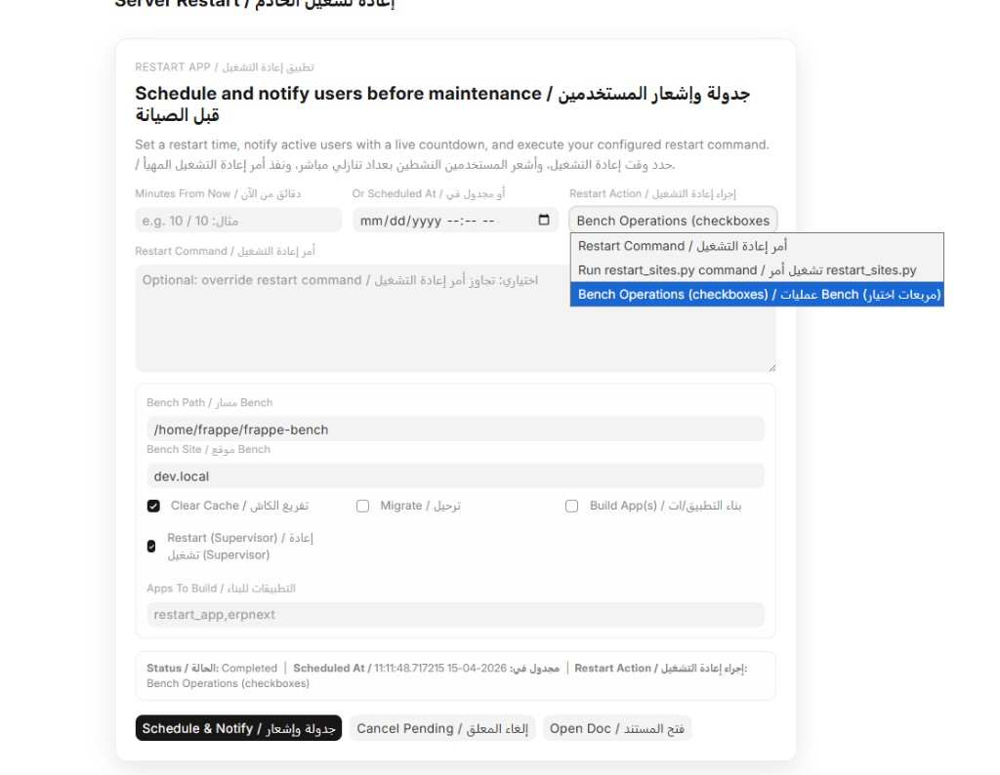
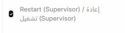
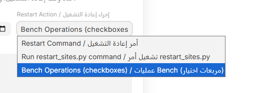

# Restart App

Restart App is a Frappe app for scheduling controlled server restart windows with bilingual user notifications (English/Arabic), live countdown popups, and bench operation controls.

## Highlights

- Schedule restart by specific date/time or minutes from now
- Notify active users globally with countdown popup and warning tones
- Bilingual UI and notifications (English / Arabic)
- Bench operations mode with checkboxes (`clear-cache`, `migrate`, `build`, `restart`)
- In-page restart control center at `/app/server-restart`
- App update utilities (check, pull, push) from the same page

## Installation

From your bench:

```bash
bench get-app https://github.com/simplehima/Restart_app
bench --site <your-site> install-app restart_app
bench --site <your-site> migrate
bench build --app restart_app
bench --site <your-site> clear-cache
bench restart
```

## Screenshots

Add screenshots to `docs/screenshots/` and keep these names for automatic rendering:

- `docs/screenshots/server-restart-page.png`
- `docs/screenshots/bench-operations.png`
- `docs/screenshots/global-popup.png`

Example markdown:

```md



```

## Suggested GitHub Topics (Tags)

Use these repository topics in GitHub:

- `frappe`
- `erpnext`
- `frappe-app`
- `maintenance`
- `scheduler`
- `restart`
- `realtime`
- `docker`
- `arabic`
- `bilingual`

## Repository

- Source: [https://github.com/simplehima/Restart_app](https://github.com/simplehima/Restart_app)
- Issues: [https://github.com/simplehima/Restart_app/issues](https://github.com/simplehima/Restart_app/issues)
